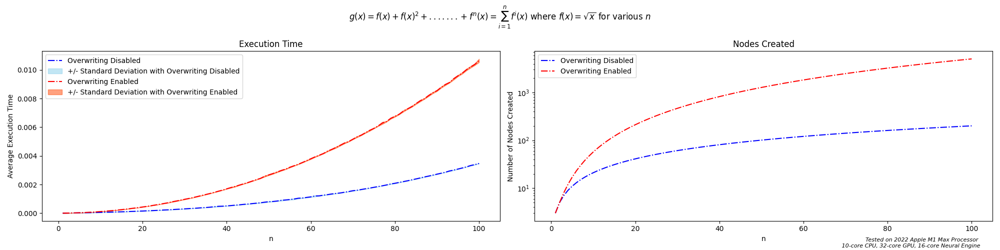

# Documentation

## Introduction

Every computer program executes a sequence of elementary arithmetic operations and elementary functions. By applying the chain rule repeatedly to these operations, derivatives of arbitrary order can be computed automatically, and accurately, to working precision. This process is known as Automatic Differentiation (AD). This package provides an AD API that supports forward mode auto-differentiation.  

Python users and the developer community may ask the question "why AD?". We would like to take a moment to emphasize the importance of this topic. The necessity of this project stems from the widespread uses and applications of automatic differentiation, especially in scientific computing and science in general. 

Derivatives play a critical role in computational statistics and are commonly calculated via symbolic or numerical differentiation methods. Both of these classical methods have shortcomings involving inefficient code and round-off errors. More importantly, these methods are slow at computing partial derivatives with respect to many inputs (i.e gradients).

Automatic differentiation is a refined method used to evaluate derivatives and forms the basis of gradient-based learning. Gradient-based optimization algorithms have a wide range of applications including linear regressions, classification algorithms, and backpropagation in Neural Networks. For these reasons, we believe that automatic differentiation is an important and necessary tool. 

As a more concrete example, recall that neural networks calculate their output by multiplying features by weights, summing them, and applying activation functions to obtain non-linear mappings. In this case, manually calculating partial derivatives for weights is intractable -- networks can house millions of weights! Automatic differentiation allows derivation to scale. 

This package decomposes a sequence of elementary operations given as Python functions. The software then
converts this sequence into a computational graph with which we can readily compute derivatives for arbitrary functions.

## Background 

### Chain Rule

The underlying mechanism of automatic differentiation is the Chain Rule. It enables the decomposition of complex derivatives of into a sequence of operations of elementary functions with known derivatives. Below we present a sufficiently general formulation of the Chain Rule:

$$
\begin{align}
\nabla f_x = \sum_{i=1}^n \frac{\partial f}{\partial y_i} \nabla y_i(x)\\
\end{align}
$$

We will first introduce the case of 1-D input and generalize it to multidimensional inputs.

_One-dimensional (scalar) Input_: Suppose we have a function $ f(y(t)) $ and we want to compute the derivative of $ f $ with respect to $ t $. This derivative is given by:

$$
\begin{align}
\frac{df}{dt} = \frac{df}{dt}\Big(y(t)\Big) \frac{dy}{dt}\\
\end{align}
$$

_Multi-dimensional (vector) Inputs_:
Before discussing vector inputs, let's first take a look at the gradient operator $ \nabla $

That is, for $ y\colon \mathbb {R} ^{n} \to \mathbb {R} $, its gradient $ \nabla y \colon \mathbb {R} ^{n} \to \mathbb {R} ^{n}$ is defined at the point $ x = (x_1, ..., x_n) $ in n-dimensional space as the vector:

$$
\begin{align}
\nabla y(x) =
\begin{bmatrix}
{\frac {\partial y}{\partial x_{1}}}(x)
\\
\vdots
\\
{\frac {\partial y}{\partial x_{n}}}(x)
\end{bmatrix}
\end{align}
$$

We will introduce direction vector $ p $ later to retrieve the derivative with respect to each $ y_i $.

### Jacobian-vector Product

The Jacobian-vector product is equivalent to the tangent trace in direction $ p $ if we input the same direction vector $p$:

$ D_p v $ = $ J p $

### Seed Vector

Seed vectors provide an efficient way to retrieve every element in a Jacobian matrix and also recover the full Jacobian in high dimensions.

Seed vectors often come into play when we want to find $ \frac {\partial f_i} {\partial x_j} $, which corresponds to the $i, j$ element of the Jacobian matrix. In high dimension automatic differentiation, we will apply seed vectors at the end of the evaluation trace where we have recursively calculated the explicit forms of tangent trace of $ f_i $ and then multiply each of them by the indicator vector $ p_j $ where the $ j $-th element of the $ p $ vector is 1.

### Evaluation (Forward) Trace

_Definition_: Suppose x = $ \begin{bmatrix} {x*1} \\ \vdots \\ {x_m} \end{bmatrix} $, we defined $ v*{k - m} = x_k $ for $ k = 1, 2, ..., m $ in the evaluation trace.

_Motivation_: The evaluation trace introduces intermediate results $ v\_{k-m} $ of elementary operations to track the differentiation.

Consider the function $ f(x):\mathbb{R}^2 \to \mathbb{R} $:

$ f(x) = log(x_1) + sin(x_1 + x_2) $

We want to evaluate the gradient $ \nabla f $ at the point $ x = \begin{bmatrix} 7 \\ 4 \end{bmatrix} $. Computing the gradient manually:

$ \nabla f = \begin{bmatrix} \frac {\partial f} {\partial x_1} \\ \frac {\partial f} {\partial x_2} \end{bmatrix} = \begin{bmatrix} \frac {1} {x_1} + \cos(x_1 + x_2) \\ \cos(x_1 + x_2) \end{bmatrix} = \begin{bmatrix} \frac {1} {7} + \cos(11) \\ \cos(11) \end{bmatrix}$

| Forward primal trace   | Forward tangent trace             | Pass with p = $[0, 1]^T$     | Pass with p = $[1, 0]^T$ |
| ---------------------- | --------------------------------- | ---------------------------- | ------------------------ |
| $v_{-1} = x_1$         | $ p_1 $                           | 1                            | 0                        |
| $v_{0} = x_2$          | $ p_2 $                           | 0                            | 1                        |
| $v_{1} = v_{-1} + v_0$ | $ D*p v*{-1} + D_p v_0 $          | 1                            | 1                        |
| $v_{2} = sin(v_1)$     | $ \cos(v_1) D_p v_1 $             | $ \cos(11) $                 | $ \cos(11) $             |
| $v_{3} = log(v_{-1})$  | $ \frac {1} {v*{-1}} D_p v*{-1} $ | $ \frac {1} {7} $            | 0                        |
| $v\_{4} = v_3 + v_2 $  | $ D*p v*{3} + D_p v_2 $           | $ \frac {1} {7} + \cos(11) $ | $ \cos(11) $             |

$D_p v_{-1} = \nabla v_{-1}^T p = (\frac {\partial v_{-1}} {\partial x_1} \nabla x_{1})^T p = (\nabla x_{1})^T p = p_1$

$D_p v_{0} = \nabla v_{0}^T p = (\frac {\partial v_{0}} {\partial x_2} \nabla x_{2})^T p = (\nabla x_{2})^T p = p_2$

$D_p v_{1} = \nabla v_{1}^T p = (\frac {\partial v_{1}} {\partial v_{-1}} \nabla v_{-1} + \frac {\partial v_{1}}{\partial v_{0}} \nabla v_{0})^T p = (\nabla v_{-1} + \nabla v_0)^T p = D_p v_{-1} + D_p v_0$

$D_p v_{2} = \nabla v_{2}^T p = (\frac {\partial v_{2}} {\partial v_{1}} \nabla v_1)^T p = \cos(v_1) (\nabla v_1)^T p = \cos(v_1) D_p v_1$

$D_p v_{3} = \nabla v_{3}^T p = (\frac {\partial v_{3}} {\partial v_{-1}} \nabla v_{-1})^T p = \frac {1} {v_{-1}} (\nabla v_{-1})^T p = \frac {1} {v_{-1}} D_p v_{-1}$

$D_p v_{4} = \nabla v_{4}^T p = (\frac {\partial v_{4}} {\partial v_3} \nabla v_{3} + \frac {\partial v_{4}}{\partial v_{2}} \nabla v_{2})^T p = (\nabla v_{3} + \nabla v_2)^T p = D_p v_{3} + D_p v_2$

### Computing the Derivative

Generalizing our findings:

From the table, we retrieved a pattern as below:

$$ D*p v_j = (\nabla v_j)^T p = (\sum*{i < j} \frac{\partial{v*j}} {\partial{v_i}} \nabla v_i)^T p = \sum*{i < j} \frac{\partial{v*j}} {\partial{v_i}} (\nabla v_i)^T p = \sum*{i < j} \frac{\partial{v_j}} {\partial{v_i}} D_p v_i$$

### Reverse Mode

The mechanism of reverse mode is defined as the following:

_Step 1:_ Calculate $ \frac {\partial f} {\partial v_j} $

_Step 2:_ Calculate $ \frac {\partial v\_{j}} {\partial v_i} $ where $ v_i $ is the immediate predecessor of $ v_j $

_Step 3:_ Multiply the result obtained in step 1 and step 2, which results in the following:
$ \frac {\partial f} {\partial v*j} \frac {\partial v*{j}} {\partial v_i} $

## How to Use

### Installation

The module is available on PyPI. Use the following command for installation. 

```
python -m pip install --extra-index-url=https://test.pypi.org/simple/ alpha-delta-team29
```

### Example Usage

Suppose we wish to take of the derivative of ```f(x) = sin(x) + x``` with respect to ```x``` at ```x = 5```. We first must first cast our variable, ```x```, as a node:

```
from autodiff_team29.node import Node

x = Node(symbol='x', value=5, derivative=1)
```

Here we have defined ```x``` by it's symbol, value, and (partial) derivative and stored these values in a ```Node``` object. Under-the-hood, the module uses these values to perform efficient autodiff computations and create new nodes. 

Now we can implement our function. To do so, let's import the required elementary function, ```sin```, from the ```elementaries``` module and perform our computation. 

```
from autodiff_team29.elementaries import sin

f = sin(x) + x
```

If we now inspect ```f```, we see that ```f``` is a new ```Node``` with a consistent symbolic representation and correct value and derivative at ```x = 5```. 

```
repr(f)

Node((sin(x)+x),4.041075725336862,1.2836621854632262)
```

### Public Interface

#### *node.Node (class)*
```commandline
Represents a node which is the foundation of a computational graph.

Parameters
----------
symbol: str
        Symbolic representation of a Node instance that acts as a unique identifier.
value: int, float, or np.ndarray
        Analytical value of the node.
derivative: int, float, or np.ndarray consisting of either type int/float , optional, default = 1
        Derivative with respect to the value attribute

Examples
--------
> x = Node('x', 10, 1)
Node('x', 10, 1)
> y = Node('y', 20)
Node('y', 20, 1)
```

#### *node.Node.symbol (function)*
```commandline
returns str: Symbolic representation of a Node instance that acts as a unique identifier.
```
#### *node.Node.value (function)*
```commandline
returns int, float, or np.ndarray: Analytical value of the node.
```
#### *node.Node.derivative (function)*
```commandline
returns int, float, or np.ndarray: Derivative with respect to the value attribute
```

#### *elementaries.sqrt (function)*
#### *elementaries.ln (function)*
#### *elementaries.log (function)*
#### *elementaries.exp (function)*
#### *elementaries.sin (function)*
#### *elementaries.cos (function)*
#### *elementaries.tan (function)*
#### *elementaries.arcsin (function)*
#### *elementaries.arccos (function)*
#### *elementaries.arctan (function)*
```commandline
    Takes in an instance class Node, int, float, or np.ndarray and returns a new node with its symbolic
    representation, forward trace, and tangent trace, which are based of the input x.

    Parameters
    ----------
    x: Node, int, float, or np.ndarray 

    Returns
    -------
    Node
        If the node already exists in the Node._NODE_REGISTRY, returns the existing node.
        Otherwise, returns a new instance of class Node and containing the symbolic representation of the node , its forward trace, and 
        tangent trace.
        
    Raises
    ------
    ValueError
        If x is not a volid input for the domain of the function
    
    Examples
    --------
    >>> ln(Node("1",1,0))
    Node("ln(1)", 0, 1)
 
    >>> sqrt(Node("-1",-1,0))
    ValueError: Square roots of negative numbers not supported
```
## Software Organization 

The module adheres to the following structure:

```
📦repo
 ┣ 📂.github
 ┃ ┗ 📂workflows
 ┃ ┃ ┣ 📜code_coverage.yml
 ┃ ┃ ┣ 📜deploy_PyPI.yml
 ┃ ┃ ┗ 📜run_tests.yml
 ┣ 📂autodiff_team29
 ┃ ┣ 📜__init__.py
 ┃ ┣ 📜elementaries.py
 ┃ ┗ 📜node.py
 ┣ docs
 ┃ ┣ 📜documentation.md
 ┃ ┣ 📜milestone1.md
 ┃ ┣ 📜milestone1.pdf
 ┃ ┗ 📜milestone2_progress.md
 ┣ 📂tests
 ┃ ┣ 📜__init__.py
 ┃ ┣ 📜elementary_test.py
 ┃ ┗ 📜node_test.py
 ┣ 📜.gitignore
 ┣ 📜LICENSE
 ┣ 📜README.md
 ┣ 📜poetry.lock
 ┗ 📜pyproject.toml
```

The two core modules are ```node``` and ```elementaries```. ```node``` defines a class, ```Node```, used to instantiate variables and their partial derivatives. ```elementaries``` houses a battery of functions with which users can create custom functions (see the example above for further details). Importantly, users may not use elementary functions provided by other modules such as ```math``` or ```numpy``` as only those in ```autodiff_team29.elementaries``` are built to operate on objects of type ```Node```.  

```.github/workflows``` houses our test suite. Our tests are integrated into our workflow in accordance with standard CI/CD practices. They are hosted by Github and run on any update to the codebase. The code coverage test passes only if code coverage is greater than 90%.

The package is hosted on PyPI. See the installation section above for details.

## Implementation Details 

To perform autodiff computations on a particular function, we create a set of unique operations or nodes defined by their variables and functions. We call this set the **registry**. A single variable ```x = 5``` and a more complex term ```sin(x) + cos(x)``` both constitute nodes. We define a node by its symbol, value, and partial derivative (see example usage above for details); and these attributes are the only public attributes necessary to perfom autodiff with our packages. The node registry keeps track of unique nodes by hashing each nodes' string symbolic representation.

Operations (addition, subtraction, and other elementary functions) on nodes combine and propagate these attributes to new nodes with consistent symbolic representations via the chain rule. Importantly, such operations check the node registry before performing any computation; this eliminates redundant computation inherent to more basic autodiff implementations. 

The `node.py` module is the backbone of our implementation. This is where we have designed our `Node` class. As mentioned, each instance of class `Node` encapsulates a symbolic representation, value, and derivative. What makes nodes so powerful is their overriding of pythons "dunder  methods", specifically `__add__`, `__mul__`, `__truediv__` and other mathematical operators. These dunder methods are overriden so that computation on `node` instance and an `int`, `float`, `numpy.ndarray`, or additional `node` returns another `node` instance. The new `node` that is returned by the dunder methods contains a forward and primal trace that is calculated from the two objects that are operated on by the dunder method. This implementation using dunder methods allows us to compute the forward and primal trace of our function simultaneously. Also, it allows for simple syntax that simply consists of mathematical operators, numbers, and arrays!

Another important module is `elementaries.py` which provides convenient commonly used mathematical functions such as `sin`, `cos`, `tan`, etc. These functions behave similarly to numpy's implementation of these functions. More specifically our implementations act as wrapper functions that make instances of class `Node` compatible with numpy's commonly used functions. In our implementation of `sin`, `cos`, etc, each function call returns a new instance of class node. Once again, this allows our users to chain expressions of nodes to calculate forward and primal traces of their functions.

## Extension

For our extension, we implemented a node registry to store unique nodes that the package can later referance instead of repeating potentially expensive computations. Importantly, there is a cost associated with our registry: the lookup. In essence, we replace much of the node computation cost with the node lookup cost. Consider the following function on a given node, $x$:

$$
g(x) = f(x) + f^2(x) + \dots + f^n(x) = \sum_{i=1}^nf^i(x)
$$

where the superscript notation indicates iterative function calls ($f^2(x) = f(f(x))$). When computed without a registry, $g(x)$ requires $\sum_{i=1}^ni$ computations; with a registry, $g(x)$ requires $n$ computations (one for each term in $g$ -- subsequent terms need only apply $f$ once more to the previous term) and $\sum_{i=1}^ni$ registry checks (if we include failed checks for new nodes). Let $t_c$ be the computation time for $f$ and $t_r$ be the lookup time for the node registry. We can formalize the registry trade-off:

$$
t_c\sum_{i=1}^ni = t_cn + t_r\sum_{i=1}^ni
$$

We now solve for the ratio of the computation times for better interpretation. 

$$
\frac{t_c}{t_r} = \frac{\sum_{i=1}^ni}{\sum_{i=1}^{n-1}i}
$$

For a given $t_c$, $t_r$, and $n$; the registry reduces time complexity if and only if:

$$
\frac{t_c}{t_r} > \frac{\sum_{i=1}^ni}{\sum_{i=1}^{n-1}i}
$$

Now consider $f(x) = \sqrt{x}$. Square root is a relatively expensive computation, and so $\frac{t_c}{t_r}$ is relatively large while look-up time remains constant. Belwo we plot the difference in autodiff time between registry and no-registry for this function We observe an exponential increase in time without the registry. 



If the user wishes to disable the registry for a function with simple, unique computations, they can do so via the `set_overwrite_mode` method of the `Node` class. See the demo below for details.

```
from autodiff_team29.node import Node
from autodiff_team29.elementaries import sqrt

# number of chained calls
N = 10

# enable node registry (registry is enabled by default)
Node.set_overwrite_mode(enabled=False)
# # disable node registry
# Node.set_overwrite_mode(enabled=True)

# instantiate node with large value (difficult computation)
x = Node("x", 123424341341544235, 1)

# iterative square root
def apply_n_square_roots(n, x):
    value = x
    for _ in range(1, n + 1):
        value = sqrt(value)
    return value

f = sum([apply_n_square_roots(n, x) for n in range(N)])
print(f.derivative)
```

## Broader Impact and Inclusivity Statement

### Broader Impact

Automatic differentiation is a powerful tool with the potential to have a broad impact across a range of fields. In particular, it has the potential to greatly accelerate research and development in the fields of machine learning and artificial intelligence, where it can be used to more efficiently and effectively train complex models.

Beyond its applications in these fields, automatic differentiation also has the potential to benefit other areas of science and engineering that rely on the solution of complex optimization problems. This includes fields such as computational biology, finance, and physics, among others.

Furthermore, the development and widespread adoption of automatic differentiation techniques has the potential to promote inclusivity and equality in the field of computer science. By making it easier and more efficient to develop and train complex models, automatic differentiation can help to level the playing field and provide opportunities for individuals and communities who may have previously been excluded from the field due to the time and resources required to develop these models.

We are excited about the potential impact of our work on automatic differentiation and look forward to seeing the ways in which it may benefit the broader world.

### Inclusivity Statement

As a community, we are dedicated to creating an inclusive and welcoming space for all individuals, regardless of their background or identity. We value and respect the unique experiences and perspectives of every member of our community, and we strive to create an environment where everyone feels safe, supported, and able to fully participate. 

Another important aspect of inclusivity is making sure that underrepresented groups are represented and included in the community. This includes individuals from marginalized backgrounds or communities, such as people of color, LGBTQ+ individuals, people with disabilities, and others. It's important to actively seek out and include the voices and perspectives of these individuals in the community, and to provide support and accommodations to ensure that they can fully participate. This can be done through outreach efforts, by providing resources and support specifically for these individuals, and by creating a welcoming and inclusive environment that makes everyone feel valued and respected. By taking these steps, we can help create a community that is truly inclusive and representative of all its members.

We are excited to work together to build a vibrant and diverse community that celebrates the contributions of all individuals. Thank you for joining us on this journey.

## Future Features

The current implementation only support forward mode AD. We would like to implement support for reverse mode in the future (see the background section above for details on forward and reverse mode AD). We would like our package to be efficient for functions of many inputs such as large neural networks; reverse mode AD is much more efficient than forward mode as the ratio of input dimension to output dimension grows. Our node registry would also help to make reverse mode even more efficient.

This will require a new graph structure of functions, but we should be able to utilize our forward mode node registry to perform the requisite forward pass before computing derivatives. The new graph structure will likely live in a new module, ```reverse```. We will have to add support for reverse mode to functions in ```elementaries``` and to the dunder methods in of the ```Node``` class. 

Lastly, we would like to add gradient descent to our implementation, which is especially useful for neural networks. The use of neural networks continues to grow across many industries, so the addition of gradient descent would be important to maximize the usefullness of package.
